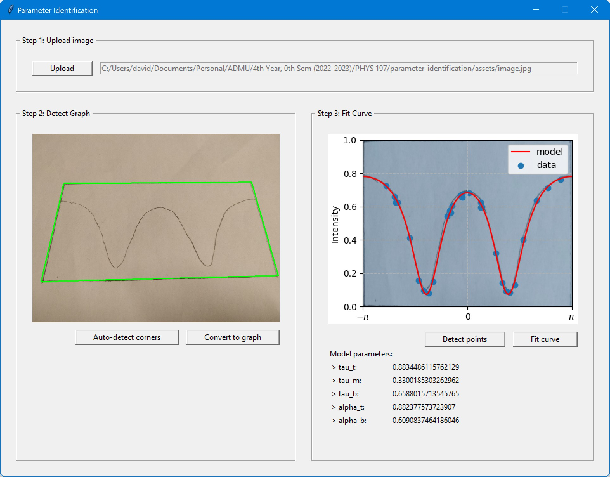
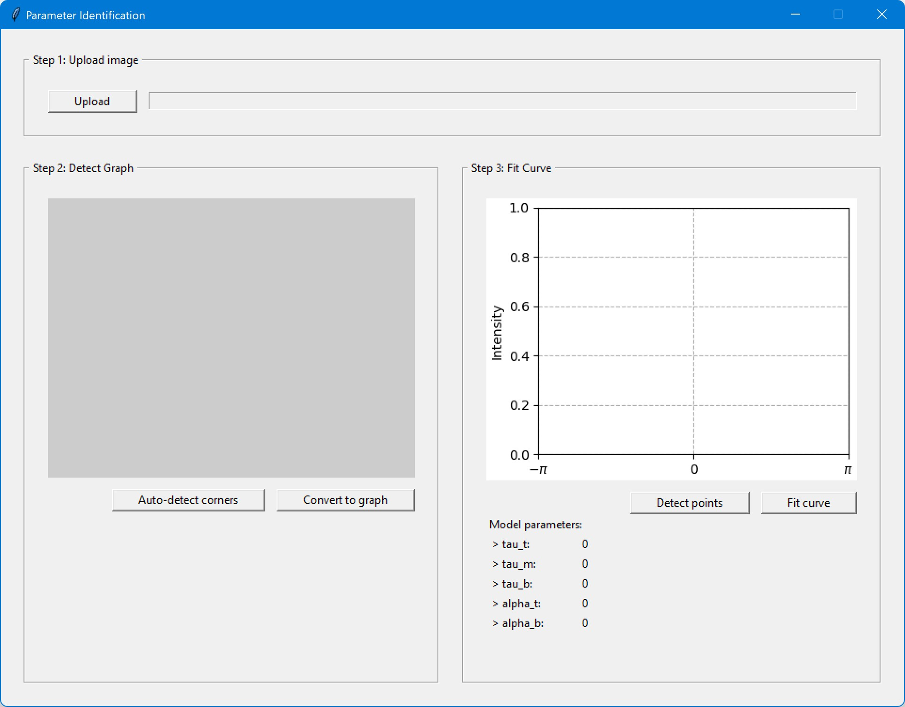

# Parameter Identification

Parameter Identification is a Python app which automatically converts drawn graph to a plot and outputs the parameters of the intensity function.



## Dependencies

Python 3.10.

## Installation

Clone the repository and run the following code:
```bash
pip install -r requirements.txt
```

## Usage
Run `app.py` using the terminal:
```bash
python app.py
```


### Steps
1. Upload image.
2. Press `Auto-detect corners` to detect the corners. A green highlight will show.
3. Press `Convert to graph` to transfer the image to the graph.
4. Press `Detect points` to detect the points in the graph. Blue scatter points will show.
5. Press `Fit curve` to create the curve. The parameters will show in the `Model parameters` and a red plot will shown.